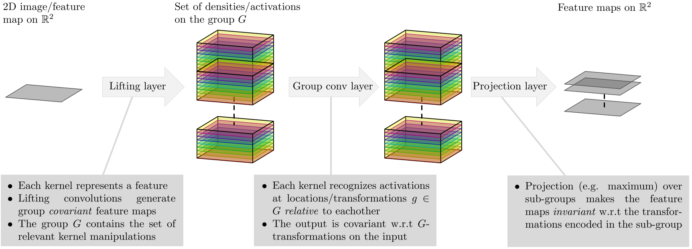
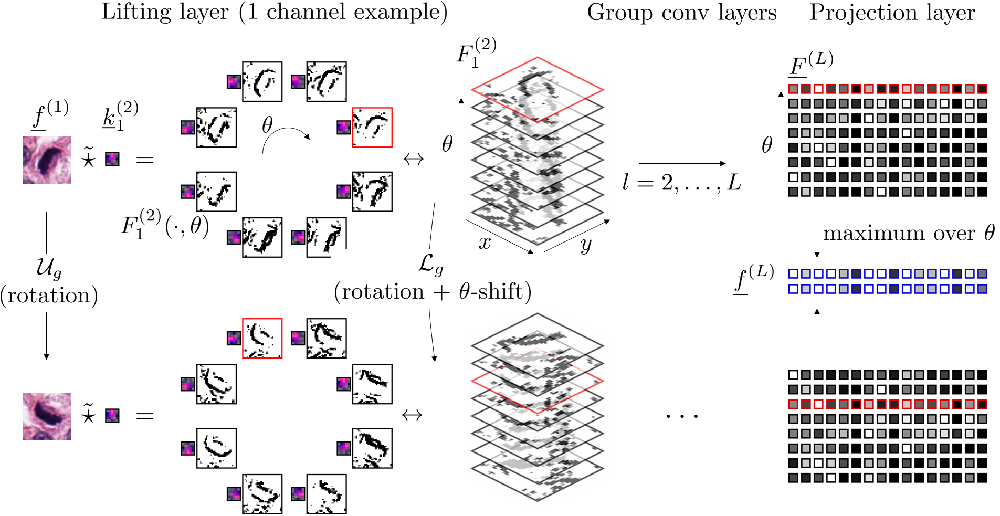
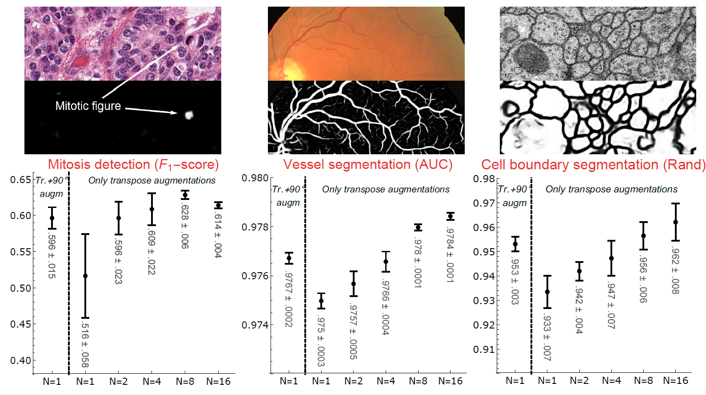

# The SE(2) group convolutional neural network library
This repository contains the code for SE(2) group convolutional networks. The theory is described in the paper:

Bekkers, E., Lafarge, M., Veta, M., Eppenhof, K., Pluim, J., Duits, R.: Roto-translation covariant
convolutional networks for medical image analysis. Accepted at MICCAI 2018, arXiv preprint arXiv:1804.03393 (2018). Available at: https://arxiv.org/abs/1804.03393

# Contents
This repository contains the following folders:
* **se2cnn** - the main python library for se2 group convolutional networks. 
* **demo** - contains a jupyter notebook demonstration of the se2cnn library and a covariance test file.

# Some notes about the proposed SE(2) CNN layers

## Group convolutional networks

The library provides code for building group equivariant convolutional networks for the case when the group G is SE(2), the group of planar roto-translations. In this case the lifting layer (se2cnn.layers.z2_se2n) probes the 2D input with rotated and translated versions of the convolution kernels. The data is thus lifted to the space of positions and orientations. In order to make the following layers (se2cnn.layers.se2n_se2n) equivariant with respect to rotations and translations of the input these layers are defined in terms of the left-regular representation of SE(2) on SE(2)-images. The kernels used in the layers are trained to recognize the (joint) activations of positions and orientations relative to each other. Finally, in order to make the entire network invariant to certain transformations one can decide to apply max-pooling (tf.reduce_max) over sub-groups. In our case we might for example do a maximum projection over the sub-group of rotations in order to make the network locally rotation invariant.

## SE(2) convolutional networks

See above a figure illustrating some of the layers in a SE(2) CNN. Top row: the activations after the lifting convolutions with a single kernel which stacked together it yields an SE(2) image. The projection layer at the end of the pipeline gives a rotation invariant feature vector. Bottom row: the same figures with a rotated input.

## Results

In the above figure the top row shows crop out images of the three tasks considered in our paper with the class probabilities generated by our SE(2) CNNs. The bottom row shows the mean results (+- standard deviation).

